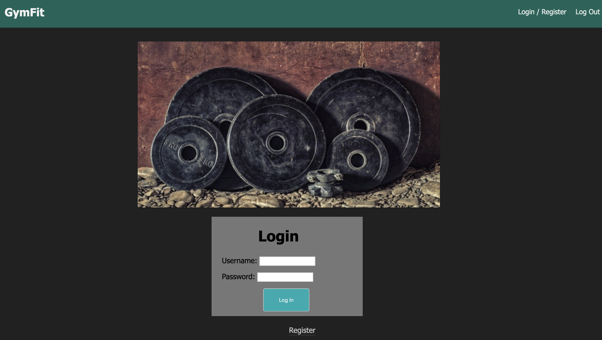
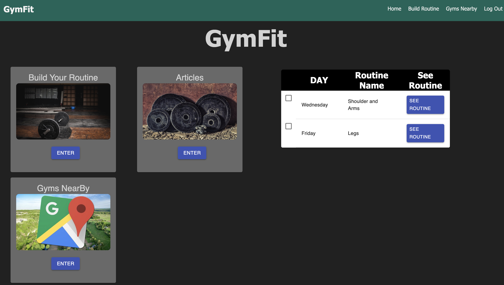
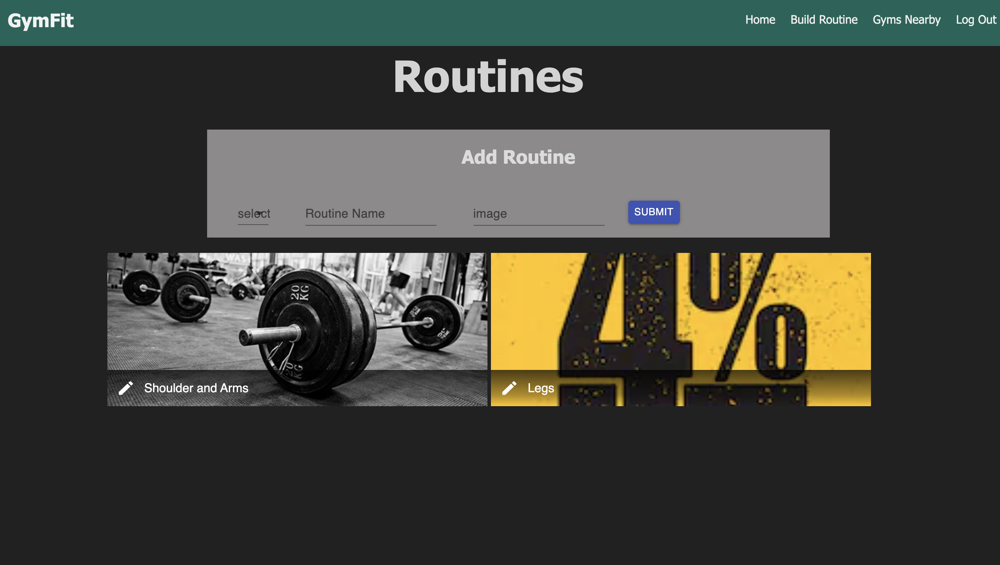
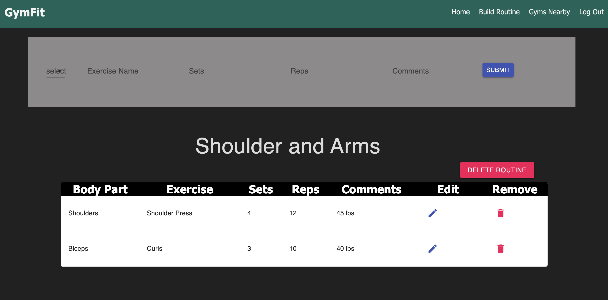
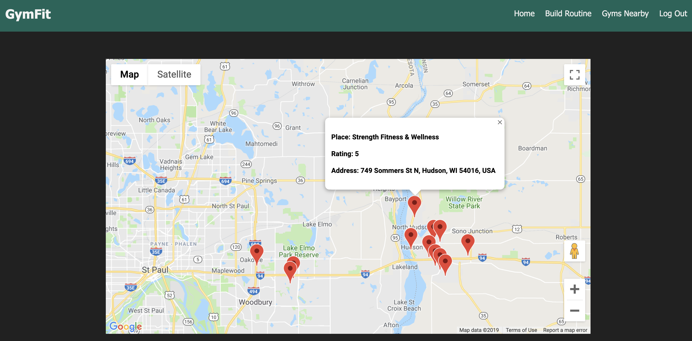

# Full-Stack React Gymfit

## Summary of Application
    - This is a full-stack application where the user can document there workouts by creating specific personalize routines for each. Within each routine, they can add, delete, and update exercises within them. Furthermore, they can organize each routine by selecting the day feature when they create or edit their routine. This will be updated in the weekly component and then organized by specific day. If the user wants to check out gyms near their area, they only have to click on the "gym near me" feature to find out where all the local gyms are. 

## Built With
    - Node.js
    - React.js
    - JavaScript
    - HTML
    - Material-UI
    - CSS
    - PostgreSQL
    - Google Maps API

## Getting Started

    1. Download this project.
    2. Have an API key from Google Maps and place it in the 'GymNearMe.js'
    3. Create a .env file and set your API key equal to GOOGLE_API_KEY. 
    4. `npm install` all dependencies, inlcuding dotenv
    5. `npm run server` 
    6. `npm run client

## Prerequisites 
    - [Node.js](https://nodejs.org/en/);
    - [PostgreSQL](https://eggerapps.at/postico/);
    - [Google Maps Platform](https://cloud.google.com/maps-platform/)

## Screen Shots

